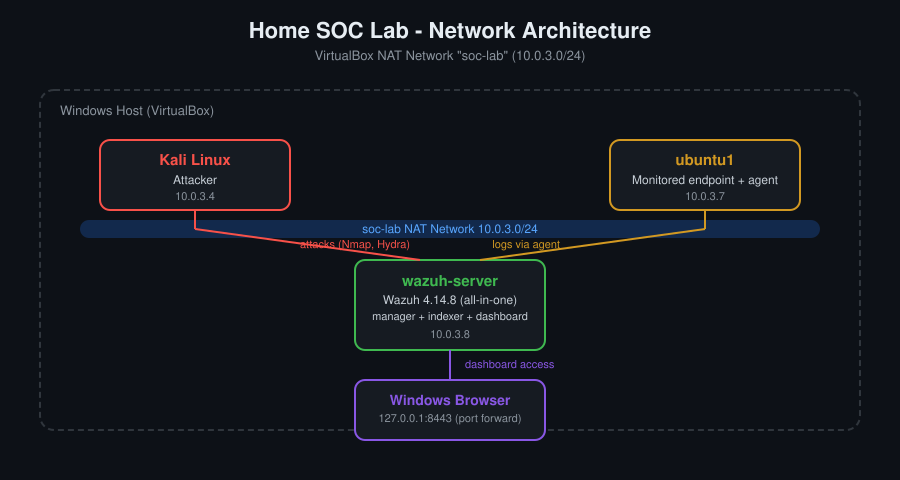
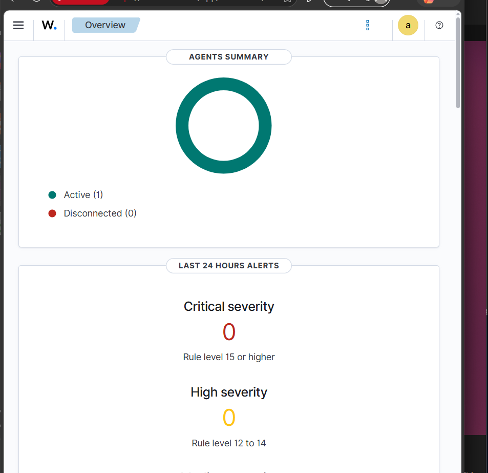

# Home SOC Lab: Wazuh SIEM

A small Security Operations Center built on a single laptop with VirtualBox. A Kali Linux attacker runs real attacks against a monitored Ubuntu endpoint, and a Wazuh SIEM detects them. I then wrote a custom detection rule mapped to MITRE ATT&CK.

**Skills shown:** SIEM deployment (Wazuh), agent management, log analysis, alert investigation, custom detection rules, MITRE ATT&CK mapping, Linux administration, virtual networking.

---

## Lab architecture



| VM | OS | Role | IP (soc-lab, 10.0.3.0/24) |
|---|---|---|---|
| wazuh-server | Ubuntu Server 22.04.5 LTS | Wazuh 4.14.8 all-in-one (manager, indexer, dashboard) | 10.0.3.8 |
| ubuntu1 | Ubuntu 25.04 | Monitored endpoint (Wazuh agent 4.14.8, SSH enabled) | 10.0.3.7 |
| kali | Kali Linux | Attacker | 10.0.3.4 |

- Hypervisor: VirtualBox, all VMs on a private **NAT Network** (`soc-lab`) so they can reach each other and the internet but are isolated from the host LAN.
- The dashboard is reached from the host through a VirtualBox port forward (`127.0.0.1:8443` to `10.0.3.8:443`).

---

## What I did

1. Created the isolated `soc-lab` NAT network and the VMs.
2. Installed Wazuh with the all-in-one installation assistant on Ubuntu Server 22.04.
3. Deployed the Wazuh agent on ubuntu1 and confirmed it reports as **Active**.
4. Ran attacks from Kali and investigated the alerts in the dashboard.
5. Wrote and tested a custom detection rule.

Detailed notes:
- [01 - Lab Setup](docs/01-lab-setup.md)
- [02 - Wazuh Install](docs/02-wazuh-install.md)
- [03 - Agent Setup](docs/03-agent-setup.md)
- [04 - Attack Scenarios](docs/04-attack-scenarios.md)
- [05 - Custom Rules](docs/05-custom-rules.md)

---

## Attack scenarios

### 1. Port scan (Nmap)

```
nmap -sV 10.0.3.7
```

**Result:** No alert was raised for the scan itself.

**Takeaway:** Wazuh analyzes logs from agents, not network traffic, so a plain port scan is not necessarily visible to it. Network-level visibility needs a tool like Suricata or Zeek.


### 2. SSH brute force (Hydra)

A throwaway account (`testuser`) with a weak password was created on ubuntu1 for this test. Hydra tried a short wordlist with the correct password last:

```
hydra -l testuser -P pass.txt ssh://10.0.3.7 -t 1
```


**Detection:** Wazuh's built-in rule **40112** (level 12) fired: *"Multiple authentication failures followed by a success."*

| Field | Value |
|---|---|
| agent.name | ubuntu1 |
| rule.id | 40112 |
| rule.level | 12 |
| data.srcip | 10.0.3.4 (Kali) |
| data.dstuser | testuser |


**Why it matters:** many failures followed by a success from the same IP is a classic sign of a compromised account.

---

## Custom detection rule

I added a rule that builds on the built-in correlation, raises the severity to level 14, names the affected user and source IP in the alert, and maps it to MITRE ATT&CK **T1110 (Brute Force)**.

File: [`rules/local_rules.xml`](rules/local_rules.xml)

```xml
<group name="local,custom,ssh,">
  <rule id="100100" level="14">
    <if_sid>40112</if_sid>
    <description>LAB: Possible compromised account - SSH brute force succeeded for $(dstuser) from $(srcip)</description>
    <mitre>
      <id>T1110</id>
    </mitre>
  </rule>
</group>
```

- `id="100100"`: custom rule IDs start at 100000 to avoid clashing with Wazuh's own.
- `if_sid`: the rule only fires after rule 40112, so it extends an existing detection.
- `$(dstuser)` and `$(srcip)`: filled in from the event, so each alert says who was attacked and from where.

Syntax was checked with `wazuh-analysisd -t` before restarting the manager.


The agent reporting in before any of this testing:



---

## What I learned

- A SIEM only sees what agents send, so detection coverage depends on what is logged and monitored.
- A small typo in a rule file (`level-"14"` instead of `level="14"`) stops the manager from loading rules, so I now test with `wazuh-analysisd -t` before every restart.
- An agent installed with a mangled command can write junk into its config, so I verify `ossec.conf` after installing.
- Correlation rules depend on the order and timing of events, so the test needs several failures and then a success.

## Next steps

- Add a Windows endpoint and monitor Windows event logs
- Add Suricata for network-level detection of scans
- Write a rule for repeated failed logins from one source in a short time
- Active response: automatically block the attacking IP

---

*Lab built for learning. All attacks were run only against my own virtual machines.*
