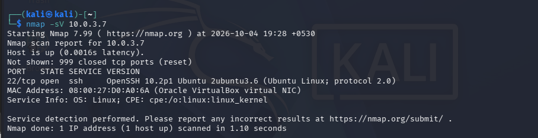
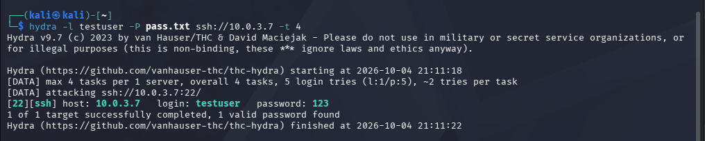
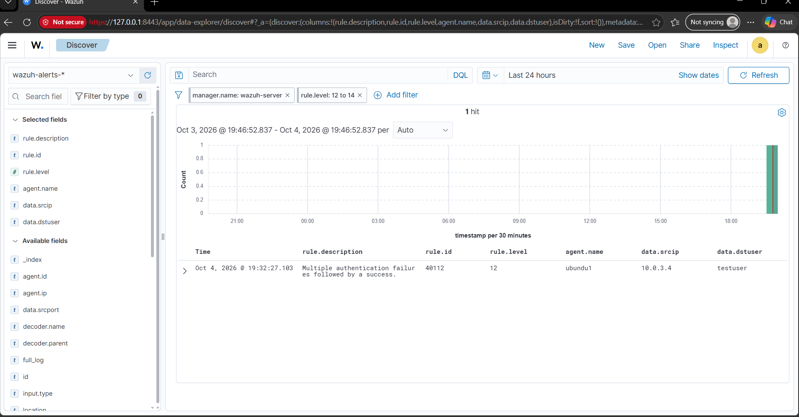
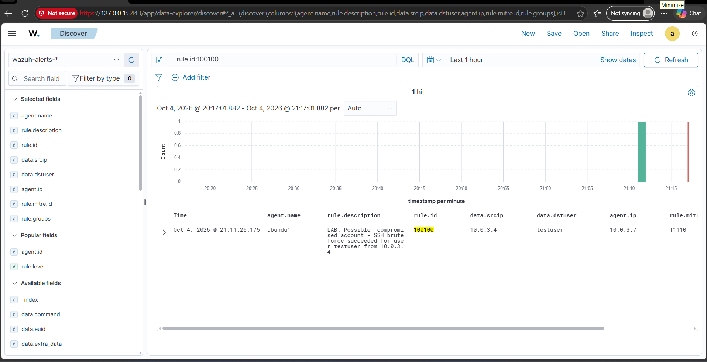

# 4. Attack Scenarios

Both attacks below were run from the `kali` VM (10.0.3.4) against `ubuntu1` (10.0.3.7), inside the isolated `soc-lab` network only.

## Scenario 1: Nmap service scan

```
nmap -sV 10.0.3.7
```



**Result:** SSH (port 22, OpenSSH) identified as open. No Wazuh alert was generated for the scan itself.

**Why:** Wazuh's detection in this lab is **log-based** — it analyzes what the OS and applications write to their logs, not raw network traffic. A port scan does not, by itself, write anything to a log file on the target, so it is invisible to this kind of agent-based monitoring. Detecting the scan itself would need a network-level tool such as Suricata or Zeek watching the wire traffic, which is listed as a future improvement.

## Scenario 2: SSH brute force (Hydra)

A short wordlist was used, with the correct password deliberately placed last so the attack produces a realistic run of failures followed by one success:

```
printf "111111\n123456\nadmin\nletmein\npassword\nqwerty\nwelcome\nabc123\nmonkey\ndragon\niloveyou\npassword123\n" > pass.txt
hydra -l testuser -P pass.txt ssh://10.0.3.7 -t 1
```



Hydra found the valid credential (`testuser` / a weak password) after the earlier attempts failed.

### Detection: built-in correlation rule

Wazuh's built-in rule **40112** fired:

> Multiple authentication failures followed by a success.

| Field | Value |
|---|---|
| agent.name | ubuntu1 |
| rule.id | 40112 |
| rule.level | 12 (High) |
| data.srcip | 10.0.3.4 (kali) |
| data.dstuser | testuser |



This is a significant finding on its own: a string of failed logins immediately followed by a successful one, from the same source IP, is a classic indicator of a compromised account — not just a scan or a probing attempt.

### Detection: custom rule

A custom rule (100100) was written to extend this detection — see [05-custom-rules.md](05-custom-rules.md) for the rule itself and the reasoning behind it.



## Notes on realism

- The target account (`testuser`) was created specifically for this test and used a deliberately weak password; this is not representative of a production account policy.
- Both attacks were confined to the isolated `soc-lab` network and never reached the host LAN or the internet.
